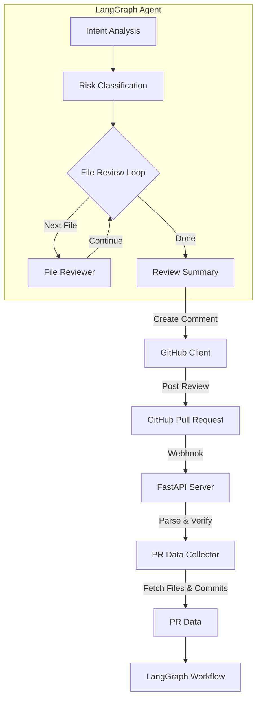
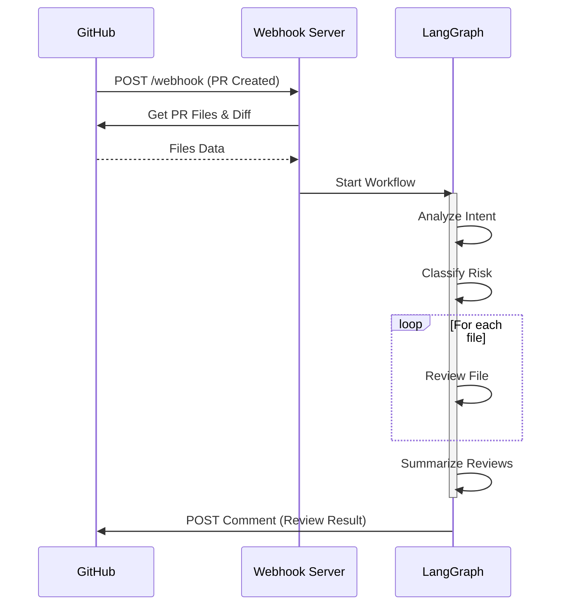

# almagest-reviewer 🌌

**An experimental GitHub code reviewer exploring agent workflows with LangGraph**

`almagest-reviewer`는 Pull Request 코드 리뷰를 자동화하기 위해 설계된  
**Agentic workflow 기반 GitHub App**입니다.  
LangGraph를 활용해 리뷰 단계를 명시적인 그래프 구조로 정의하고,  
자동 판단과 사람의 개입(human-in-the-loop)을 자연스럽게 결합하는 것을 목표로 합니다.

---

## Motivation

대부분의 AI 코드 리뷰 도구는 다음 중 하나에 머무릅니다.

- 단순 LLM 호출 기반의 일회성 리뷰
- 규칙 기반 정적 분석
- 사람이 최종 판단을 하기 어려운 블랙박스형 자동화

`almagest-reviewer`는 다음 질문에서 출발했습니다.

> 코드 리뷰를 **에이전트의 사고 흐름(process)**로 모델링할 수는 없을까?

이 프로젝트는 **LangGraph**를 사용해  
리뷰 과정을 **명시적인 상태 전이(State Transition)**,  
**루프(loop)**, 그리고 **인간 개입 지점(human-in-the-loop)**으로 구성합니다.

---

## Key Features

- **Agentic Code Review**  
  코드 분석 → 이슈 분류 → 리뷰 생성 과정을 그래프로 모델링
- **Multi-LLM Provider 지원**  
  Anthropic 및 Google Gemini 지원
- **LangGraph-based Workflow**  
  단순 체인이 아닌 상태 기반 에이전트 플로우를 통한 체계적인 리뷰
- **GitHub App Integration**  
  Pull Request 이벤트 기반 실시간 자동 리뷰 코멘트 작성
- **Intelligent Risk Assessment**  
  PR의 의도 분석 및 위험도(Risk) 자동 분류

---

## High-level Architecture



---

## Installation & Setup

### 1. Prerequisites

- Python 3.11 이상
- GitHub App 생성 및 설치 권한
- Anthropic API Key 또는 Google API Key

### 2. Environment Variables Setup

`.env.example`을 복사하여 `.env` 파일을 생성하고 필수 값을 입력합니다.

```bash
cp .env.example .env
```

**주요 설정 항목:**
- `GITHUB_APP_ID`: 생성한 GitHub App의 ID
- `GITHUB_PRIVATE_KEY_PATH`: 다운로드한 `.pem` 키 파일 경로
- `GITHUB_WEBHOOK_SECRET`: GitHub App 설정에서 지정한 Webhook Secret
- `GITHUB_INSTALLATION_ID`: 앱이 설치된 레포지토리의 Installation ID
- `LLM_PROVIDER`: `anthropic` 또는 `google`
- `ANTHROPIC_API_KEY` 또는 `GOOGLE_API_KEY`

### 3. Running the Server

#### Option A: Local Execution
```bash
# 가상환경 활성화 (필요 시)
source .venv/bin/activate

# 서버 실행 (uvicorn)
uvicorn main:app --host 0.0.0.0 --port 8000
```

#### Option B: Docker Execution (Recommended)
Docker를 사용하면 일관된 환경에서 서버를 실행할 수 있습니다.

**Docker Compose 사용:**
```bash
docker compose up -d --build
```

**Docker CLI 전용:**
```bash
docker build -t almagest-reviewer .
docker run -d -p 8000:8000 --env-file .env almagest-reviewer
```

---

## Usage Guide

1. **GitHub App 설치**: 리뷰를 받고자 하는 레포지토리에 생성한 GitHub App을 설치합니다.
2. **Webhook 설정**: 서버 주소(또는 ngrok 주소)를 GitHub App의 Webhook URL(`https://your-domain.com/webhook`)에 등록합니다.
3. **Pull Request 생성**: 해당 레포지토리에서 PR을 생성하거나 코드를 업데이트합니다.
4. **자동 리뷰 확인**: `almagest-reviewer`가 자동으로 PR을 분석하고 리뷰 코멘트를 남깁니다.

---

## Architecture Deep Dive

### LangGraph Workflow



리뷰 프로세스는 다음과 같은 4단계 그래프 노드로 구성됩니다.

1. **Intent Analysis**: PR 제목과 설명을 분석하여 기능 추가, 버그 수정, 리팩토링 등의 의도를 파악합니다.
2. **Risk Classification**: 변경 규모와 중요도를 바탕으로 위험도를 평가합니다.
3. **File Review (Loop)**: 변경된 각 파일을 순회하며 코드 품질, 보안, 가독성 등을 상세 리뷰합니다.
4. **Review Summary**: 모든 분석 결과를 종합하여 최종 의견(Approve, Request Changes 등)과 요약문을 작성합니다.

---

## Troubleshooting

- **401 Unauthorized**: GitHub App ID나 Private Key 경로가 올바른지 확인하세요.
- **Invalid Webhook Signature**: `GITHUB_WEBHOOK_SECRET`이 GitHub 설정과 일치하는지 확인하세요.
- **LLM API Errors**: API Key가 유효한지, 할당량이 남아있는지 확인하세요.

---

## Roadmap

- [ ] **Human-in-the-loop Gate**: 특정 위험도 이상의 PR은 사람의 승인 후 코멘트 게시
- [ ] **Custom Rule Integration**: 팀별 코딩 컨벤션 및 룰셋 적용 기능
- [ ] **Incremental Review**: 전체 파일이 아닌 변경된 라인(diff) 중심의 최적화된 리뷰
- [ ] **Multi-model Ensemble**: 여러 LLM의 의견을 종합하여 리뷰 정확도 향상


---

**Built with ❤️ using LangGraph and LLMs**