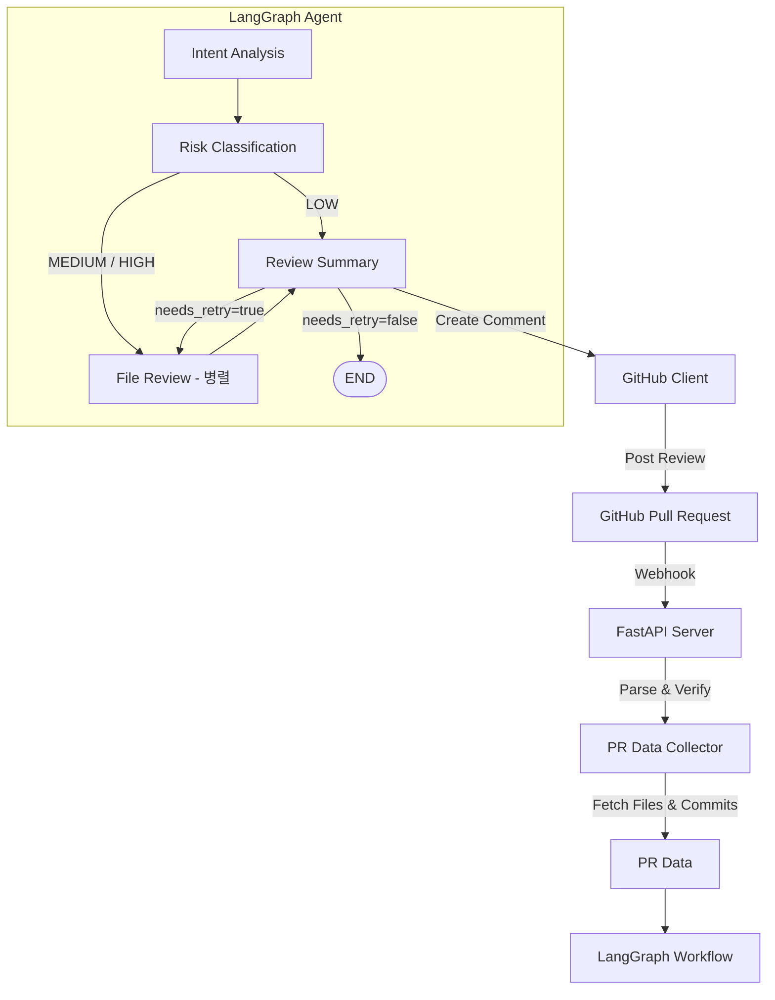
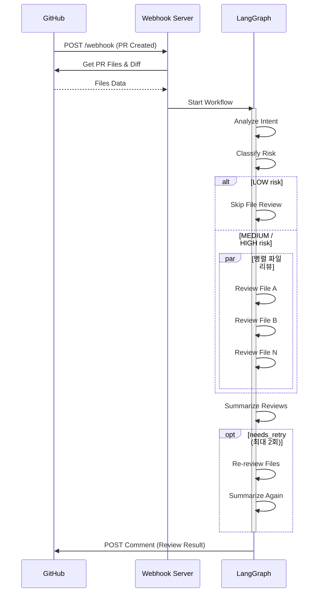

# almagest-reviewer 🌌

**An experimental GitHub code reviewer exploring agent workflows with LangGraph**

`almagest-reviewer`는 Pull Request 코드 리뷰를 자동화하기 위해 설계된  
**Agentic workflow 기반 GitHub App**입니다.  
LangGraph를 활용해 리뷰 단계를 명시적인 그래프 구조로 정의하고,  
자동 판단과 사람의 개입(human-in-the-loop)을 자연스럽게 결합하는 것을 목표로 합니다.

---

## Motivation

대부분의 AI 코드 리뷰 도구는 다음 중 하나에 머무릅니다.

- 단순 LLM 호출 기반의 일회성 리뷰
- 규칙 기반 정적 분석
- 사람이 최종 판단을 하기 어려운 블랙박스형 자동화

`almagest-reviewer`는 다음 질문에서 출발했습니다.

> 코드 리뷰를 **에이전트의 사고 흐름(process)**로 모델링할 수는 없을까?

이 프로젝트는 **LangGraph**를 사용해  
리뷰 과정을 **명시적인 상태 전이(State Transition)**,  
**루프(loop)**, 그리고 **인간 개입 지점(human-in-the-loop)**으로 구성합니다.

---

## Key Features

- **Agentic Code Review**  
  코드 분석 → 이슈 분류 → 리뷰 생성 과정을 그래프로 모델링
- **Multi-LLM Provider 지원**
  Anthropic, Google Gemini, Ollama(로컬) 지원
- **LangGraph-based Workflow**  
  단순 체인이 아닌 상태 기반 에이전트 플로우를 통한 체계적인 리뷰
- **GitHub App Integration**  
  Pull Request 이벤트 기반 실시간 자동 리뷰 코멘트 작성
- **Intelligent Risk Assessment**  
  PR의 의도 분석 및 위험도(Risk) 자동 분류

---

## High-level Architecture


```mermaid
graph TD
    GitHub[GitHub Pull Request] -->|Webhook| Server[FastAPI Server]
    Server -->|Parse & Verify| Collector[PR Data Collector]
    Collector -->|Fetch Files & Commits| Data[PR Data]
    Data --> SubGraph[LangGraph Workflow]

    subgraph "LangGraph Agent"
        Intent[Intent Analysis] --> Risk[Risk Classification]
        Risk -->|LOW| Summary[Review Summary]
        Risk -->|MEDIUM / HIGH| Review[File Review - 병렬]
        Review --> Summary
        Summary -->|needs_retry=true| Review
        Summary -->|needs_retry=false| End([END])
    end

    Summary -->|Create Comment| Client[GitHub Client]
    Client -->|Post Review| GitHub
```

---

## Installation & Setup

### 1. Prerequisites

- Python 3.11 이상
- GitHub App 생성 및 설치 권한
- Anthropic API Key 또는 Google API Key

### 2. Environment Variables Setup

`.env.example`을 복사하여 `.env` 파일을 생성하고 필수 값을 입력합니다.

```bash
cp .env.example .env
```

**주요 설정 항목:**
- `GITHUB_APP_ID`: 생성한 GitHub App의 ID
- `GITHUB_PRIVATE_KEY_PATH`: 다운로드한 `.pem` 키 파일 경로
- `GITHUB_WEBHOOK_SECRET`: GitHub App 설정에서 지정한 Webhook Secret
- `GITHUB_INSTALLATION_ID`: 앱이 설치된 레포지토리의 Installation ID
- `LLM_PROVIDER`: `anthropic`, `google`, `ollama` 중 하나
- `ANTHROPIC_API_KEY` 또는 `GOOGLE_API_KEY` (provider에 맞게 설정)
- `OLLAMA_BASE_URL`: Ollama 사용 시 서버 주소 (기본값: `http://localhost:11434`)
- `OLLAMA_MODEL`: Ollama 사용 시 모델 이름 (기본값: `llama3.2`)

### 3. Running the Server

#### Option A: Local Execution
```bash
# 가상환경 활성화 (필요 시)
source .venv/bin/activate

# 서버 실행 (uvicorn)
uvicorn main:app --host 0.0.0.0 --port 8000
```

#### Option B: Docker Execution (Recommended)
Docker를 사용하면 일관된 환경에서 서버를 실행할 수 있습니다.

**Docker Compose 사용:**
```bash
docker compose up -d --build
```

**Docker CLI 전용:**
```bash
docker build -t almagest-reviewer .
docker run -d -p 8000:8000 --env-file .env almagest-reviewer
```

---

## Usage Guide

1. **GitHub App 설치**: 리뷰를 받고자 하는 레포지토리에 생성한 GitHub App을 설치합니다.
2. **Webhook 설정**: 서버 주소(또는 ngrok 주소)를 GitHub App의 Webhook URL(`https://your-domain.com/webhook`)에 등록합니다.
3. **Pull Request 생성**: 해당 레포지토리에서 PR을 생성하거나 코드를 업데이트합니다.
4. **자동 리뷰 확인**: `almagest-reviewer`가 자동으로 PR을 분석하고 리뷰 코멘트를 남깁니다.

---

## 외부 레포지토리 연동 가이드

`almagest-reviewer`는 **GitHub App 기반**으로 동작하기 때문에, 새로운 레포지토리를 연동하기 위해 서버 코드를 수정하거나 재배포할 필요가 없습니다.
GitHub App 설치만으로 연동이 완료되며, 이후 레포지토리 정보는 DB에 자동으로 등록됩니다.

### 동작 원리

기존에는 `GITHUB_INSTALLATION_ID` 환경변수에 하나의 레포지토리를 고정해두는 방식이었습니다.
현재는 GitHub 웹훅 payload에서 `installation_id`를 동적으로 추출하므로, **앱이 설치된 모든 레포지토리**에서 자동으로 리뷰가 동작합니다.

PR이 열리거나 업데이트될 때 GitHub가 전송하는 웹훅 payload에는 아래 정보가 포함됩니다.

```json
{
  "installation": { "id": 123456 },
  "repository": {
    "id": 987654,
    "name": "my-repo",
    "owner": { "login": "my-org" }
  },
  "pull_request": { ... }
}
```

서버는 이 값들을 그대로 추출해 `repositories` 테이블에 upsert합니다. 이미 등록된 레포지토리라면 `installation_id`만 갱신되고, 처음 보는 레포지토리라면 새 row가 생성됩니다.

```
GitHub PR 이벤트 발생
       ↓
웹훅 payload에서 installation_id, repo 정보 추출
       ↓
repositories 테이블 upsert (신규 등록 또는 갱신)
       ↓
LangGraph 리뷰 워크플로우 실행
       ↓
GitHub PR에 리뷰 코멘트 게시
```

### 연동 절차

#### Step 1. GitHub App 추가 설치

GitHub App의 설치 범위를 확장하는 방법은 두 가지입니다.

**방법 A — 특정 레포지토리에 추가 설치 (권장)**

1. GitHub → `Settings` → `Applications` → `almagest-reviewer` 옆 `Configure` 클릭
2. `Repository access` 섹션에서 `Only select repositories` 선택
3. 연동하려는 레포지토리를 검색하여 추가
4. `Save` 클릭

**방법 B — 조직(org)의 모든 레포지토리에 설치**

1. 조직 페이지 → `Settings` → `GitHub Apps` → `almagest-reviewer` → `Configure`
2. `Repository access`를 `All repositories`로 변경
3. `Save` 클릭

> 이 설정은 GitHub App을 **처음 생성한 계정**이나 **조직 Admin**만 변경할 수 있습니다.

#### Step 2. Webhook 이벤트 권한 확인

GitHub App이 `Pull requests` 이벤트를 수신하도록 설정되어 있어야 합니다.

1. GitHub App 관리 페이지 → `Permissions & events`
2. `Subscribe to events` 섹션에서 `Pull request` 체크 확인
3. `Repository permissions`에서 `Pull requests: Read & write` 확인

이미 설정되어 있다면 별도 작업 불필요합니다.

#### Step 3. 자동 등록 확인

설치가 완료된 레포지토리에서 **PR을 하나 열면** 서버가 웹훅을 수신하고, `repositories` 테이블에 해당 레포지토리가 자동으로 등록됩니다.

등록 여부를 직접 확인하려면 아래 쿼리를 사용하세요.

```bash
docker exec -it almagest-reviewer-db-1 psql -U almagest -d almagest_reviewer \
  -c "SELECT id, owner, name, installation_id, is_active, created_at FROM repositories ORDER BY created_at DESC;"
```

### 특정 레포지토리 리뷰 비활성화

연동은 유지하되 리뷰를 일시 중단하고 싶은 경우, `is_active` 컬럼을 `false`로 변경합니다.

```sql
UPDATE repositories
SET is_active = false
WHERE owner = 'my-org' AND name = 'my-repo';
```

> 현재 서버 코드는 `is_active` 값을 확인하지 않습니다. 이 기능은 향후 구현 예정이며, 현재는 DB 레벨에서 상태를 기록하는 용도로만 사용됩니다.

### 연동 해제

특정 레포지토리에 더 이상 리뷰가 필요 없다면:

1. **GitHub App 설치 해제**: GitHub App 설정 페이지에서 해당 레포지토리를 제거합니다. 이후 해당 레포지토리의 웹훅은 더 이상 서버로 전달되지 않습니다.
2. **(선택) DB 데이터 삭제**: 쌓인 리뷰 데이터까지 삭제하려면 아래 쿼리를 실행합니다. `CASCADE` 설정으로 하위 테이블(`pull_requests`, `reviews`, `review_comments`, `skills`) 데이터도 함께 삭제됩니다.

```sql
DELETE FROM repositories
WHERE owner = 'my-org' AND name = 'my-repo';
```

---

## Architecture Deep Dive

### LangGraph Workflow


```mermaid
sequenceDiagram
    participant GH as GitHub
    participant Svr as Webhook Server
    participant LG as LangGraph

    GH->>Svr: POST /webhook (PR Created)
    Svr->>GH: Get PR Files & Diff
    GH-->>Svr: Files Data

    Svr->>LG: Start Workflow

    activate LG
    LG->>LG: Analyze Intent
    LG->>LG: Classify Risk

    alt LOW risk
        LG->>LG: Skip File Review
    else MEDIUM / HIGH risk
        par 병렬 파일 리뷰
            LG->>LG: Review File A
            LG->>LG: Review File B
            LG->>LG: Review File N
        end
    end

    LG->>LG: Summarize Reviews

    opt needs_retry (최대 2회)
        LG->>LG: Re-review Files
        LG->>LG: Summarize Again
    end
    deactivate LG

    LG->>GH: POST Comment (Review Result)
```

리뷰 프로세스는 다음과 같은 4단계 그래프 노드로 구성됩니다.

1. **Intent Analysis**: PR 제목과 설명을 분석하여 기능 추가, 버그 수정, 리팩토링 등의 의도를 파악합니다.
2. **Risk Classification**: 변경 규모와 중요도를 바탕으로 위험도(LOW / MEDIUM / HIGH)를 평가합니다. LOW로 판단되면 파일 리뷰를 건너뛰고 바로 요약 단계로 이동합니다.
3. **File Review (병렬)**: MEDIUM/HIGH 위험도의 PR에 대해 변경된 모든 파일을 동시에 리뷰합니다. 코드 품질, 보안, 성능, 가독성 등을 검토합니다.
4. **Review Summary**: 모든 분석 결과를 종합하여 최종 의견(APPROVE / REQUEST_CHANGES / COMMENT)과 요약문을 작성합니다. 리뷰가 불충분하다고 판단되면 파일 리뷰를 최대 2회까지 재실행합니다.

---

## Database Schema

PostgreSQL 기반의 데이터 레이어로 구성되며, 테이블 간 계층 구조는 다음과 같습니다.

```
repositories
├── skills            (저장소별 리뷰 스킬 설정)
└── pull_requests     (저장소의 PR들)
    └── reviews       (PR별 AI 리뷰 스냅샷)
        └── review_comments  (리뷰 내 개별 코멘트)
```

모든 부모-자식 관계는 `CASCADE` 삭제가 적용됩니다.

### 테이블 역할

| 테이블 | 역할 |
|--------|------|
| `repositories` | GitHub App이 설치된 저장소 등록 정보. `owner`, `name`, `installation_id`로 저장소를 식별하고 리뷰 활성화 여부(`is_active`)를 관리하는 최상위 엔티티 |
| `pull_requests` | 저장소에 열린 PR 메타정보. `state`, `risk_level`, `triage_priority`를 통해 리뷰 우선순위와 상태를 추적 |
| `reviews` | 특정 커밋(`head_sha`) 기준으로 수행된 AI 리뷰 결과 스냅샷. `pr_intent`, `risk_assessment`, `file_reviews`를 JSONB로 저장하고 `review_decision`(APPROVE/REQUEST_CHANGES/COMMENT)을 기록 |
| `review_comments` | 리뷰 내 파일별 개별 코멘트. `comment_type`(issue/suggestion)과 `is_addressed`를 통해 팔로업 처리 여부를 추적 |
| `skills` | 저장소별 리뷰 기준 커스터마이징 설정. `criteria` JSONB 필드에 `focus_areas`, `ignore_patterns` 등 세부 리뷰 기준을 저장 |
| `alembic_version` | Alembic 마이그레이션 버전 추적용 시스템 테이블 |

---

## Troubleshooting

- **401 Unauthorized**: GitHub App ID나 Private Key 경로가 올바른지 확인하세요.
- **Invalid Webhook Signature**: `GITHUB_WEBHOOK_SECRET`이 GitHub 설정과 일치하는지 확인하세요.
- **LLM API Errors**: API Key가 유효한지, 할당량이 남아있는지 확인하세요.

---

## Roadmap

현재 프로젝트는 기본 초석을 다진 단계이며, 실무 수준의 서비스로 고도화하는 것을 목표로 합니다.

### 핵심 기능 확장 (진행 예정)

- [ ] **Skills**: 사용자/레포지토리별 PR 리뷰 기준 커스터마이징. 팀마다 다른 컨벤션, 중점 검토 항목, 리뷰 스타일을 에이전트 스킬 형태로 정의하고 조합할 수 있는 구조로 확장
- [ ] **Multi-repo Support**: 여러 레포지토리에 앱을 설치하고, 레포별 설정을 독립적으로 관리. 멀티테넌시 구조로의 전환 및 DB 도입
- [ ] **PR Triage**: 여러 PR이 동시에 열려있을 때 어떤 PR을 먼저 검토해야 하는지 우선순위를 자동 판단 (위험도, 변경 규모, 대기 시간 등 종합)
- [ ] **Follow-up**: 리뷰 코멘트가 반영됐는지 추적하고, 수정 후 재검토 수행. 새로운 문제가 도입됐는지도 함께 확인

### 기존 계획

- [ ] **Human-in-the-loop Gate**: 특정 위험도 이상의 PR은 사람의 승인 후 코멘트 게시
- [ ] **Incremental Review**: 전체 파일이 아닌 변경된 라인(diff) 중심의 최적화된 리뷰
- [ ] **Multi-model Ensemble**: 여러 LLM의 의견을 종합하여 리뷰 정확도 향상


---

**Built with ❤️ using LangGraph and LLMs**