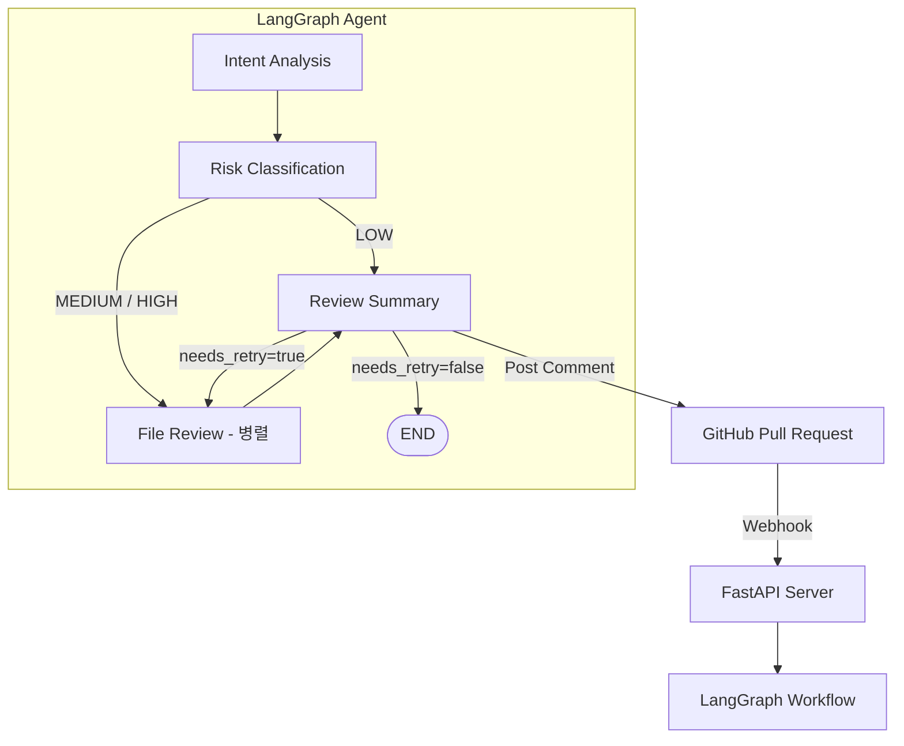

# almagest-reviewer 🌌

**An experimental GitHub code reviewer exploring agent workflows with LangGraph**

`almagest-reviewer`는 Pull Request 코드 리뷰를 자동화하기 위해 설계된 **Agentic workflow 기반 GitHub App**입니다.  
LangGraph를 활용해 리뷰 단계를 명시적인 그래프 구조로 정의합니다.

---

## Key Features

- **Agentic Code Review** — 코드 분석 → 위험도 분류 → 파일 리뷰 → 요약 과정을 그래프로 모델링
- **Multi-LLM Provider** — Anthropic, Google Gemini, Ollama(로컬) 지원
- **GitHub App Integration** — Pull Request 이벤트 기반 실시간 자동 리뷰 코멘트
- **Intelligent Risk Assessment** — PR 의도 분석 및 위험도(LOW / MEDIUM / HIGH) 자동 분류
- **Web Dashboard** — GitHub OAuth 로그인 기반 관리 UI

---

## Architecture


```mermaid
graph TD
    GitHub[GitHub Pull Request] -->|Webhook| Server[FastAPI Server]
    Server --> SubGraph[LangGraph Workflow]

    subgraph "LangGraph Agent"
        Intent[Intent Analysis] --> Risk[Risk Classification]
        Risk -->|LOW| Summary[Review Summary]
        Risk -->|MEDIUM / HIGH| Review[File Review - 병렬]
        Review --> Summary
        Summary -->|needs_retry=true| Review
        Summary -->|needs_retry=false| End([END])
    end

    Summary -->|Post Comment| GitHub
```

---

## Quick Start

```bash
# 1. 환경변수 설정
cp .env.example .env

# 2. Docker Compose로 실행
chmod +x deploy.sh
./deploy.sh deploy
```

| 주소 | 설명 |
|------|------|
| `http://localhost:8000` | API 서버 + 웹 대시보드 |
| `http://localhost:5173` | 프론트엔드 개발 서버 (hot-reload) |

주요 환경변수: `GITHUB_APP_ID`, `GITHUB_PRIVATE_KEY_PATH`, `GITHUB_WEBHOOK_SECRET`, `LLM_PROVIDER`, `ANTHROPIC_API_KEY` / `GOOGLE_API_KEY`

---

자세한 사용법 및 배포 가이드는 **[https://reviewer.okdoitttt.com](https://reviewer.okdoitttt.com)** 에서 확인하세요.

---

**Built with ❤️ using LangGraph and LLMs**
